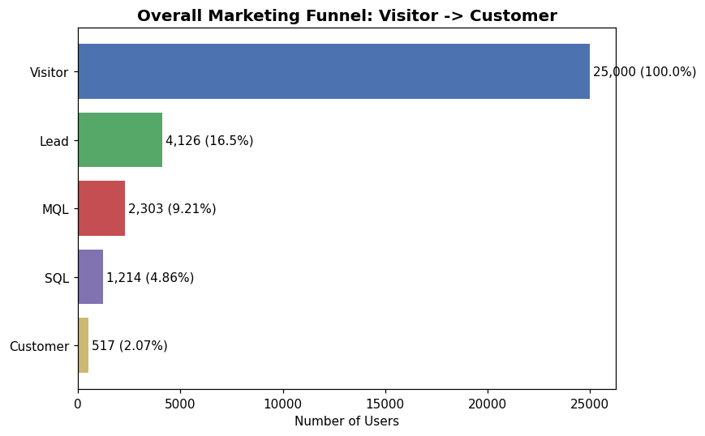
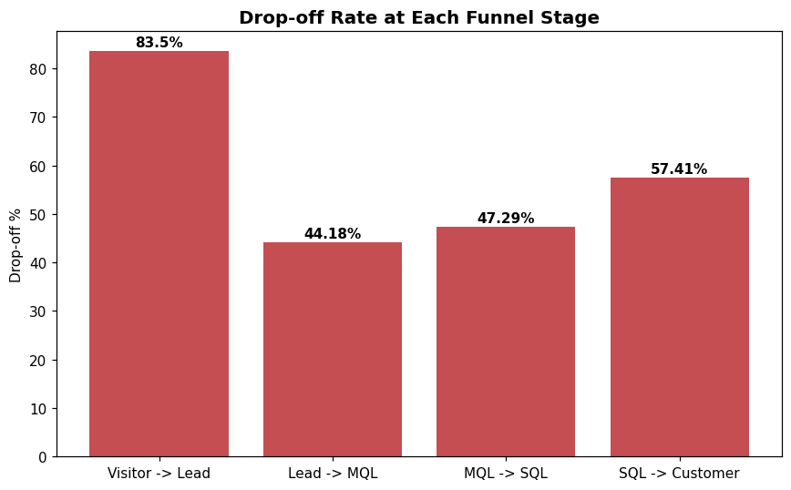
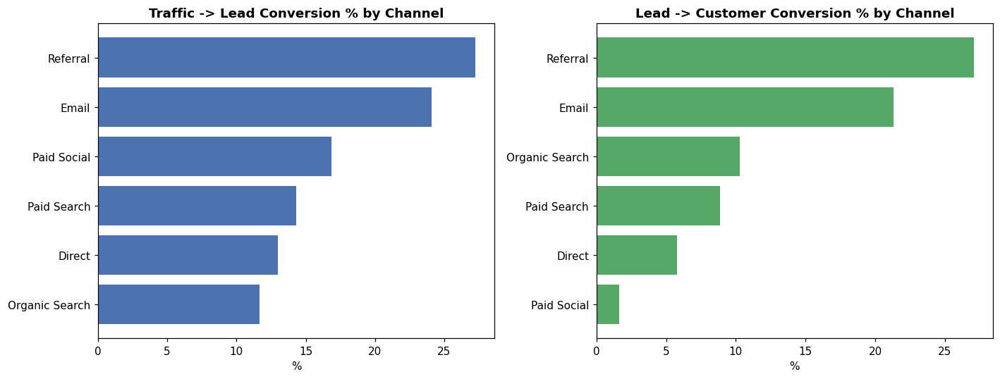
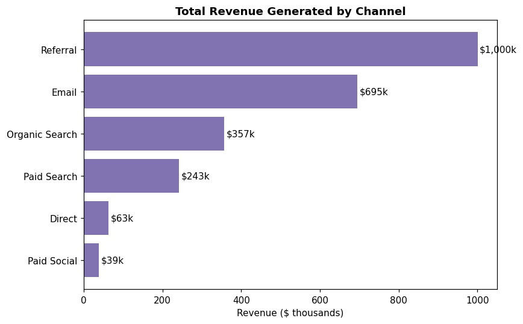
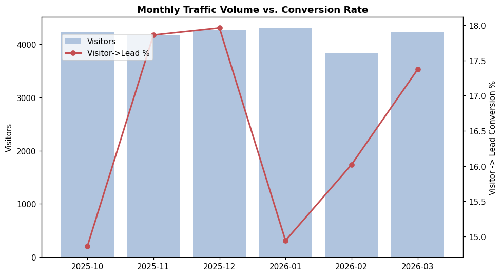

# 📊 FUTURE_DS_03 — Marketing Funnel & Conversion Performance Analysis

**Data Science & Analytics Internship — Task 3**
🔗 Internship by [Future Interns](https://futureinterns.com/author/sujanshetty263gmail-com/)

---

## 📌 Project Overview

Every business loses potential customers at different stages of its marketing
funnel — some people visit the website and never come back, some become leads
but never buy. Understanding **where** and **why** this happens is one of the
most valuable skills in marketing analytics, growth, and sales operations.

This project analyzes a marketing/lead funnel dataset that tracks users
through five stages:

```
Visitor → Lead → MQL → SQL → Customer
```

The goal was to answer four core business questions:

- 📉 Where are users dropping off in the funnel?
- 🎯 Which channels bring high-quality leads?
- 📈 How can conversion rates be improved?
- 🛠️ Which stages need the most optimization?

---

## 🗂️ Dataset

A simulated but realistic funnel dataset of **25,000 website visitors**,
tracked across:

- **5 funnel stages** — Visitor, Lead, MQL (Marketing Qualified Lead),
  SQL (Sales Qualified Lead), Customer
- **6 acquisition channels** — Organic Search, Paid Search, Paid Social,
  Email, Referral, Direct
- **12 campaigns**, **3 device types**, **5 regions**
- **6 months of activity** (Oct 2025 – Mar 2026)

> Simulated data was used per the task's dataset guidance, which explicitly
> allows "simulated, anonymized, or business-specific data" that reflects a
> real marketing funnel scenario.

---

## 🧰 Tools & Technologies

- **Python** — pandas, numpy, matplotlib
- **Jupyter Notebook** — for exploratory data analysis and documenting
  analytical logic
- Full source code, raw dataset, and the executed notebook are included in
  **`marketing-funnel-analysis.zip`**

---

## 🔻 Overall Funnel Results

| Stage | Users Reaching Stage | % of Total Visitors | Conversion from Previous Stage |
|---|---:|---:|---:|
| Visitor | 25,000 | 100.00% | — |
| Lead | 4,126 | 16.50% | 16.50% |
| MQL | 2,303 | 9.21% | 55.82% |
| SQL | 1,214 | 4.86% | 52.71% |
| Customer | 517 | 2.07% | 42.59% |

**Overall Visitor → Customer conversion rate: 2.07%**



---

## 📉 Where Are Users Dropping Off?



| From → To | Users Lost | Drop-off % |
|---|---:|---:|
| Visitor → Lead | 20,874 | **83.50%** |
| Lead → MQL | 1,823 | 44.18% |
| MQL → SQL | 1,089 | 47.29% |
| SQL → Customer | 697 | 57.41% |

🔑 **Biggest leak:** the **Visitor → Lead** stage. This is a top-of-funnel /
landing-page problem, not a sales-process problem — every stage after Lead
retains 40–56% of users, which is comparatively healthy.

---

## 🎯 Channel Performance

| Channel | Visitors | Leads | Customers | Visitor→Lead % | Lead→Customer % | Visitor→Customer % | Revenue |
|---|---:|---:|---:|---:|---:|---:|---:|
| **Referral** | 2,545 | 694 | 188 | 27.27% | **27.09%** | **7.39%** | $1,000,255 |
| **Email** | 2,961 | 714 | 152 | 24.11% | 21.29% | 5.13% | $695,207 |
| Paid Search | 5,032 | 720 | 64 | 14.31% | 8.89% | 1.27% | $242,507 |
| Organic Search | 6,935 | 807 | 83 | 11.64% | 10.29% | 1.20% | $357,351 |
| Direct | 2,000 | 260 | 15 | 13.00% | 5.77% | 0.75% | $63,102 |
| **Paid Social** | 5,527 | 931 | 15 | 16.84% | **1.61%** | **0.27%** | $38,519 |





---

## 💡 Key Insights

1. **Referral and Email are the highest-quality channels** — lower volume,
   but by far the best Lead→Customer conversion (27% and 21%) and the
   highest total revenue.
2. **Paid Social drives the most leads but converts the worst** (only 1.6%
   Lead→Customer) — a classic sign of high-volume, low-intent traffic.
3. **83.5% of all visitors never become a lead** — the single biggest
   opportunity in this funnel; even a small lift here has an outsized
   impact on total customers.
4. **Conversion rates peak in November–December**, consistent with seasonal
   / holiday campaign intent.
5. **Roughly 1 in 8 leads (12.5%)** eventually becomes a paying customer,
   once someone enters the funnel as a Lead.

---

## ✅ Recommendations

| # | Recommendation | Why |
|---|---|---|
| 1 | **Fix the Visitor → Lead stage first** — A/B test landing pages, shorten forms, improve mobile speed | Highest-leverage fix; 83.5% of visitors are lost here |
| 2 | **Shift ~10–15% of Paid Social budget → Referral & Email** | Paid Social converts ~17x worse than Referral |
| 3 | **Tighten MQL → SQL qualification criteria** | Nearly half of MQLs never reach SQL — a lead-scoring problem |
| 4 | **Increase spend & sales capacity in Nov–Dec** | Conversion rates measurably peak in this window |
| 5 | **Route leads by channel quality**, not just recency | Referral/Email leads deserve faster follow-up given their higher close rate |

---

## 📁 Repository Contents

| File | Description |
|---|---|
| `marketing-funnel-analysis.zip` | Full project — raw dataset, data-generation script, executed Jupyter notebook, and all chart images |
| `01_overall_funnel.png` – `05_monthly_trend.png` | Exported chart visuals used in this README |
| `README.md` | This file |

> 📦 Unzip `marketing-funnel-analysis.zip` for the complete, organized project
> (`data/`, `notebooks/`, `visuals/`), the analysis notebook, and a detailed
> `INSIGHTS_AND_RECOMMENDATIONS.md` write-up.

---

## 🚀 How to Reproduce

```bash
pip install pandas numpy matplotlib jupyter
python data/generate_data.py
jupyter notebook notebooks/funnel_analysis.ipynb
```

---

## 🏁 About This Task

This project was completed as **Task 3** of the **Future Interns Data
Science & Analytics Internship (2026)**, focused on funnel and conversion
analysis — a core, directly billable skill used across startups, digital
marketing agencies, SaaS companies, and growth/sales teams.

**Skills demonstrated:** funnel & conversion analysis · marketing & growth
analytics · KPI tracking · business-focused insight generation ·
data-driven decision making

---
⭐ If you found this analysis useful, feel free to star this repo!
